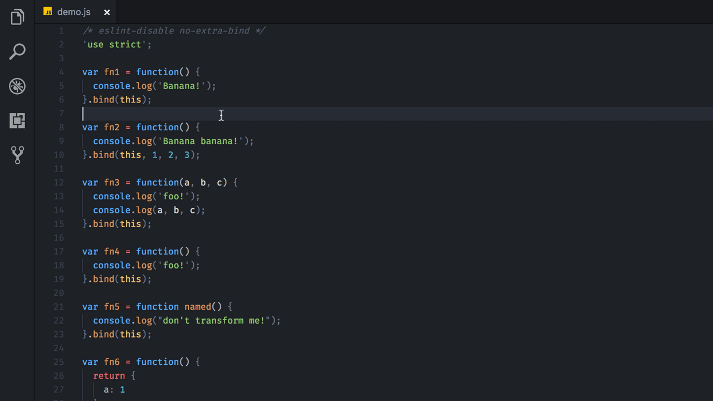

# [WIP] vscodemod – Run codemod on selected code

VSCode Extension for doing JavaScript code modifications (AST to AST transformations) in VSCode using [jscodeshift](https://github.com/facebook/jscodeshift).

**Disclaimer**: Currently work in progress. Not all codemods are complete or take into account all cases, and they aren't tested. Any feedback, pull requests or issues are highly appriciated. Feel free to join in on the project by creating codemods and/or tests.

## Why?

I often find myself doing the same code transformations manually when coding: toggling between functions and classes (for React), between arrow functions and normal functions, arrow functions without explicit return to functions with explicit return, etc. All these types of transformations can be done automatically and safely by AST-transformation. This project tries to realise that – by collecting common transform tasks in a convenient VSCode extension.

## Usage

## Roadmap

- Support for custom codemods (reading from dir)
- More codemods.
- Dry-run preview?
- Integration with prettier if format on save?
- Smarter meny selection based on AST of selected code?
